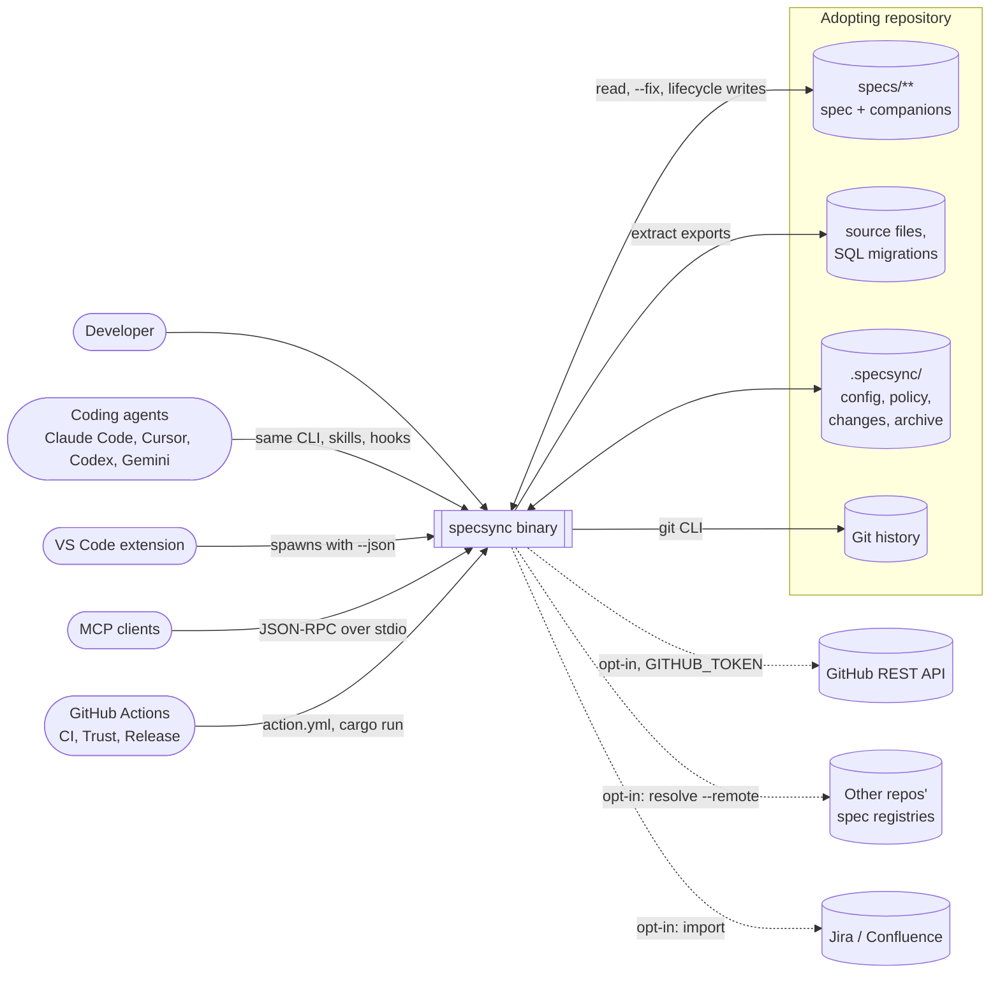
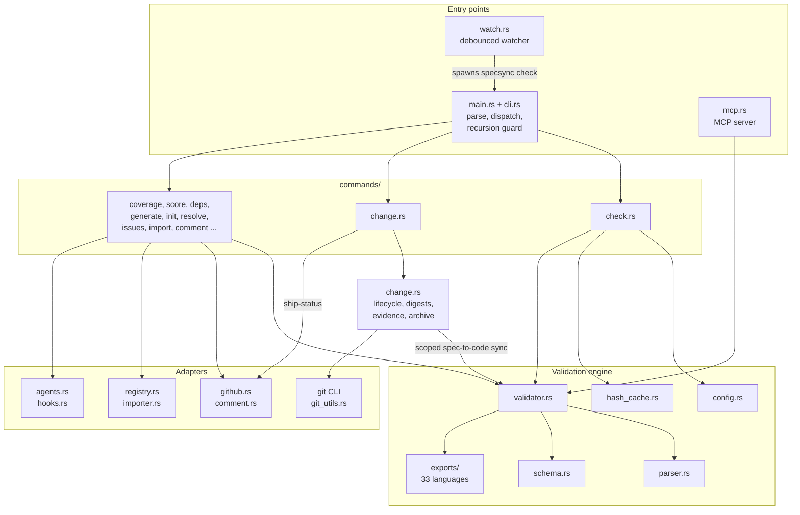
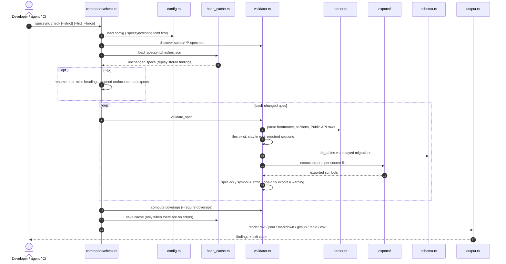
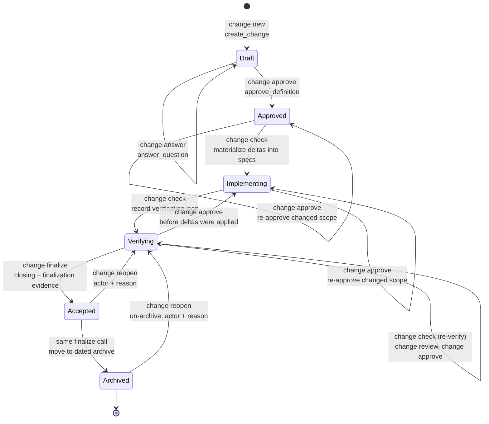
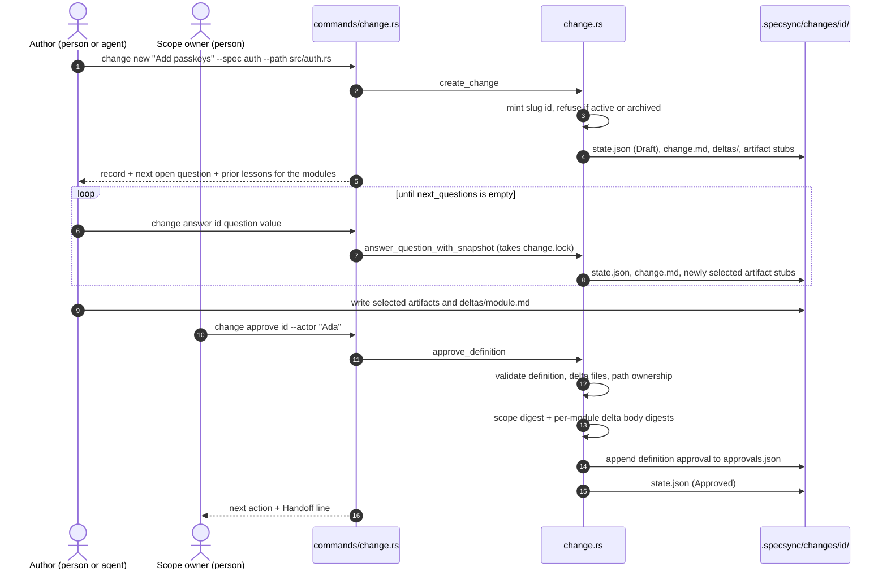
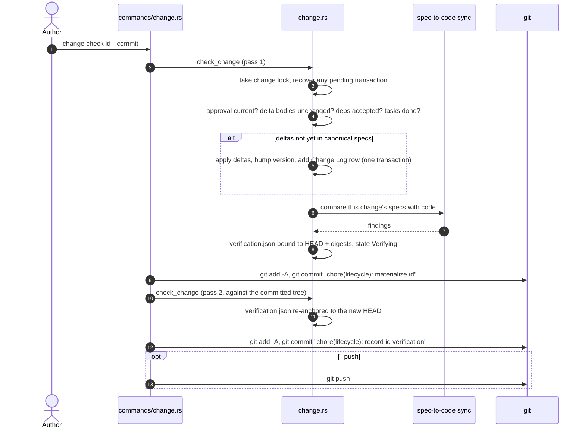
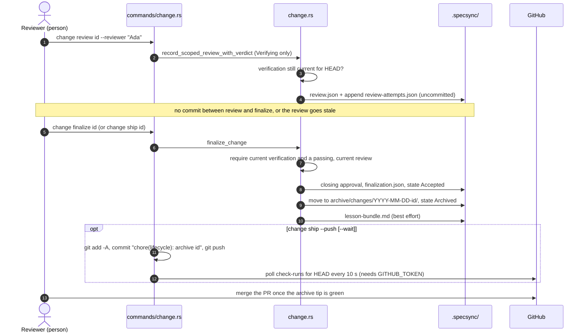
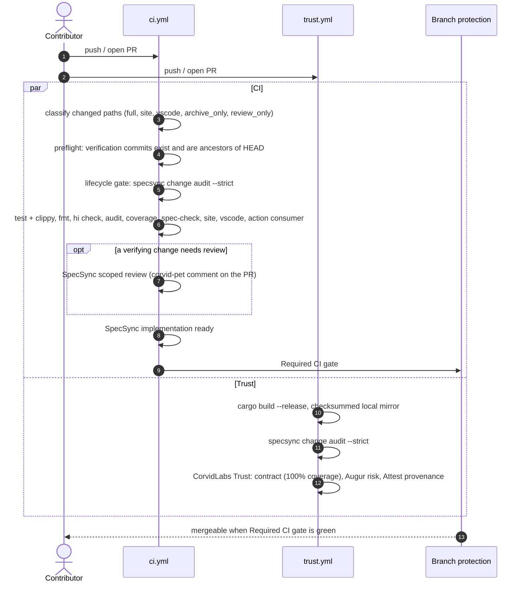
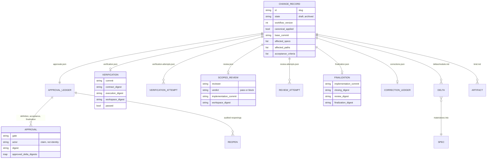

# SpecSync high-level design

This document explains how SpecSync works end to end: the binary, the validation engine, the
verified change lifecycle, the evidence it leaves in Git, and the CI, Trust and release machinery
around it. It describes **SpecSync 6.0.0** as it exists on `main`. Claims are traceable to files in this
repository, linked inline. Where something could not be established from the code, it says
**Unknown**.

User-facing guides live elsewhere; this page ties them together. Start with the
[related documents](#related-documents) table if you are looking for a specific guide.

Contents:

1. [Purpose](#1-purpose)
2. [Context](#2-context)
3. [Components](#3-components)
4. [Key flows](#4-key-flows)
5. [Data](#5-data)
6. [Runtime and deployment](#6-runtime-and-deployment)
7. [Security and trust boundaries](#7-security-and-trust-boundaries)
8. [Failure modes and limits](#8-failure-modes-and-limits)
9. [Decisions](#9-decisions)
10. [Glossary](#10-glossary)

---

## 1. Purpose

SpecSync is a single Rust binary, `specsync`, that keeps Markdown module contracts (`*.spec.md`)
and source code honest with each other. `specsync check` compares every spec's Public API table
with the symbols the code actually exports, in both directions, and fails when a spec names
something the code no longer has. On top of that check sits an opt-in, verified change lifecycle
(`specsync change …`): a change is drafted through a deterministic interview, its scope is
approved once by a person, it is verified against the code, reviewed, and archived with its
evidence in the same pull request. Its users are developers, the coding agents working for them
(Claude Code, Cursor, Codex, Gemini CLI), and CI. The core never calls a model, needs no API key
and no hosted service ([`SCOPE.md`](../SCOPE.md), [`INTENT.md`](../INTENT.md)).

## 2. Context



Solid arrows are the default local path. Dotted arrows happen only when a command or flag asks
for them:

| External system | Used by | How | Source |
|---|---|---|---|
| GitHub REST API (`api.github.com`) | `import github`, `issues`, MCP `specsync_issues`, `change ship-status`, `change ship --wait` | in-process `ureq`, needs `GITHUB_TOKEN` | [`src/github.rs`](../src/github.rs), [`src/commands/change.rs`](../src/commands/change.rs) |
| GitHub via `gh` CLI | `comment --pr`, `issues --create`, `check --create-issues` | `gh pr comment`, `gh issue create`, using gh's own login | [`src/commands/comment.rs`](../src/commands/comment.rs), [`src/github.rs`](../src/github.rs) |
| `raw.githubusercontent.com` | `resolve --remote` / `--verify` | `ureq`, optional `GITHUB_TOKEN` / `GH_TOKEN` | [`src/registry.rs`](../src/registry.rs) |
| Jira, Confluence | `import jira`, `import confluence` | `ureq`, `JIRA_*` / `CONFLUENCE_*` env vars | [`src/importer.rs`](../src/importer.rs) |
| Git | nearly everything that records evidence | the `git` CLI, bounded by [`src/lifecycle-validation-limits.json`](../src/lifecycle-validation-limits.json) | [`src/change.rs`](../src/change.rs), [`src/git_utils.rs`](../src/git_utils.rs) |

A plain `specsync check` makes no network call. Its only network path is the opt-in
`--create-issues` flag ([`src/commands/check.rs`](../src/commands/check.rs)).

## 3. Components

### 3.1 Layers



The CLI is the only engine. The VS Code extension, the GitHub Action, MCP clients and the
installed agent skills all end up running the same commands and reading the same output
([`site/src/content/docs/architecture.md`](../site/src/content/docs/architecture.md)).

### 3.2 Modules

Every source file is claimed by one of the 62 module specs under [`specs/`](../specs/); this
repository checks itself at 100% file coverage. The table names the spec to read for detail.

| Area | Files | Owns | Spec |
|---|---|---|---|
| Entry and grammar | [`src/main.rs`](../src/main.rs), [`src/cli.rs`](../src/cli.rs) | Global flags, subcommand grammar, default command (`check`), blocking lifecycle commands from re-entering themselves (`SPECSYNC_VERIFICATION_CONTEXT`) | `specs/cli`, `specs/cli_args` |
| Shared command plumbing | [`src/commands/mod.rs`](../src/commands/mod.rs) | Config loading and spec discovery for commands, spec filters, validation runs, exit codes | `specs/commands` |
| Configuration | [`src/config.rs`](../src/config.rs), [`src/types.rs`](../src/types.rs), [`src/manifest.rs`](../src/manifest.rs) | `.specsync/config.toml` and legacy fallbacks, shared types, manifest-aware source detection | `specs/config`, `specs/types`, `specs/manifest` |
| Spec parsing | [`src/parser.rs`](../src/parser.rs) | Frontmatter, required sections, Public API tables, the single `strip_frontmatter` | `specs/parser` |
| Validation | [`src/validator.rs`](../src/validator.rs), [`src/ignore.rs`](../src/ignore.rs), [`src/util.rs`](../src/util.rs) | Structural and API checks, coverage, `.specsyncignore` suppressions | `specs/validator`, `specs/ignore`, `specs/util` |
| Export extraction | [`src/exports/`](../src/exports/) (regex), [`src/exports/ast/`](../src/exports/ast/) (tree-sitter) | Language detection by extension and public-symbol extraction | `specs/exports` |
| Schema drift | [`src/schema.rs`](../src/schema.rs) | Replaying SQL migrations into a table/column snapshot | `specs/schema` |
| Dependency graph | [`src/deps.rs`](../src/deps.rs) | `depends_on` graph, cycles, undeclared imports, Mermaid/DOT output | `specs/deps` |
| Incremental cache | [`src/hash_cache.rs`](../src/hash_cache.rs), [`src/commands/rehash.rs`](../src/commands/rehash.rs) | `.specsync/hashes.json` and replayable findings | `specs/hash_cache`, `specs/rehash` |
| Quality | [`src/scoring.rs`](../src/scoring.rs) | 0–100 score over five 20-point components | `specs/scoring` |
| Change lifecycle | [`src/change.rs`](../src/change.rs), [`src/commands/change.rs`](../src/commands/change.rs) | Interview, approvals, deltas, verification, review, finalization, archive, recovery | `specs/change`, `specs/cmd_change` |
| Module maturity | [`src/commands/lifecycle.rs`](../src/commands/lifecycle.rs) | Spec `status` transitions (`draft → review → active → stable → deprecated → archived`) | `specs/cmd_lifecycle` |
| Authoring | [`src/generator.rs`](../src/generator.rs), `commands/new.rs`, `scaffold.rs`, `generate.rs`, `wizard.rs`, `init.rs` | Deterministic spec and companion scaffolds, project init | `specs/generator`, `specs/cmd_*` |
| Maintenance | [`src/compact.rs`](../src/compact.rs), [`src/archive.rs`](../src/archive.rs), [`src/merge.rs`](../src/merge.rs), [`src/changelog.rs`](../src/changelog.rs), [`src/view.rs`](../src/view.rs) | Changelog trimming, task archival, spec merge-conflict repair, spec changelogs, role views | matching `specs/*` |
| Cross-project | [`src/registry.rs`](../src/registry.rs), `commands/resolve.rs`, `commands/init_registry.rs` | `owner/repo@module` references and registry files | `specs/registry`, `specs/cmd_resolve` |
| GitHub | [`src/github.rs`](../src/github.rs), [`src/comment.rs`](../src/comment.rs), `commands/issues.rs`, `commands/import.rs`, [`src/importer.rs`](../src/importer.rs) | Issue links, drift issues, PR comments, imports | `specs/github`, `specs/comment`, `specs/importer` |
| Agents | [`src/agents.rs`](../src/agents.rs), [`src/hooks.rs`](../src/hooks.rs), [`src/mcp.rs`](../src/mcp.rs), [`src/mcp_tools_lock.rs`](../src/mcp_tools_lock.rs) | Native skills, instruction snippets, Git pre-commit hook, MCP server and its tool lock | `specs/agents`, `specs/hooks`, `specs/mcp` |
| Watch | [`src/watch.rs`](../src/watch.rs) | Debounced re-runs of `check` | `specs/watch` |

The full module graph is generated from the specs themselves: `specsync deps --mermaid` prints it
(about 60 nodes, too many to draw legibly here).

### 3.3 Command families

Running `specsync` with no subcommand runs `check` ([`src/main.rs`](../src/main.rs)). Global flags
(`--strict`, `--require-coverage`, `--root`, `--format`, `--json`, `--enforcement`, status
filters) are defined once in [`src/cli.rs`](../src/cli.rs). The full reference is
[`site/src/content/docs/cli.md`](../site/src/content/docs/cli.md).

| Family | Commands |
|---|---|
| Validate | `check` (default), `coverage`, `score`, `deps`, `diff`, `stale`, `report`, `rules`, `watch` |
| Author | `init`, `new`, `add-spec`, `scaffold`, `generate`, `wizard` |
| Lifecycle | `change …` (verified delivery), `lifecycle …` (module maturity) |
| Integrations | `mcp` (+ `mcp lock`, `mcp diff`), `agents`, `hooks`, `comment`, `issues`, `import` |
| Maintenance | `compact`, `archive-tasks`, `merge`, `changelog`, `rehash`, `migrate`, `view` |
| Cross-project | `init-registry`, `resolve` |

**Enforcement.** `EnforcementMode` in [`src/types.rs`](../src/types.rs) is `warn`, `enforce-new` or
`strict`, and the default is `strict`: a bare `check` exits 1 on any error, while warnings still
pass unless `--strict` is given. `warn` always exits 0; `enforce-new` fails only when source files
have no spec. `--require-coverage N` is evaluated after the mode (`compute_exit_code`,
`exit_with_status` in [`src/commands/mod.rs`](../src/commands/mod.rs)).

## 4. Key flows

### 4.1 `specsync check`



Stage by stage, per [`src/commands/check.rs`](../src/commands/check.rs) (`cmd_check`) and
[`src/validator.rs`](../src/validator.rs) (`validate_spec`):

1. **Config.** The first file found among `.specsync/config.toml`, `.specsync/config.json`,
   `.specsync.toml` and `specsync.json` wins. A config file that exists but cannot be loaded stops
   the run instead of falling back to defaults.
2. **Discovery.** `*.spec.md` under `specs_dir` (default `specs`), skipping names that start with
   `_` and recording skipped symlinks.
3. **Cache.** With no `--force`, `--strict`, `--fix` or spec filter, specs whose spec, companions,
   sources and global inputs are all unchanged **replay** their stored findings; they do not
   silently pass.
4. **Structure.** `module`, `version`, `status` and a non-empty `files` list are required. Every
   listed file must exist inside the root. Frontmatter is read by a hand-written line parser, not a
   YAML library, and duplicate keys are errors ([`src/parser.rs`](../src/parser.rs)).
5. **Sections.** The configured required sections (defaults: Purpose, Public API, Invariants,
   Behavioral Examples, Error Cases, Dependencies, Change Log). Draft specs skip this.
6. **Schema.** When `schema_dir` is set, documented tables and columns are checked against the
   migrations replayed in filename order. A documented column missing from the schema is an error;
   an undocumented column or a type mismatch is a warning.
7. **API surface.** The first backtick span in the first cell of Public API table rows is compared
   with the exports of the spec's `files`. A symbol the spec lists but the code lacks is an
   **error** (the document is lying). An export the spec omits is a **warning** (the document is
   incomplete), and `--strict` makes it fail.
8. **Dependencies.** `check` only verifies that each local `depends_on` path exists.
   Graph-level checks (cycles, undeclared imports) belong to `specsync deps`; cross-project
   references belong to `specsync resolve`.
9. **Coverage.** File and LOC coverage always runs and feeds `--require-coverage` and
   `enforce-new`.

`check` never reads `.specsync/changes/` or the archive. That is deliberate: the drift check and
the delivery lifecycle are separate questions (the comment in `cmd_check`,
[`src/commands/check.rs`](../src/commands/check.rs); `REQ-cmd-check-004` in
[`specs/cmd_check/requirements.md`](../specs/cmd_check/requirements.md)).

**Export extraction.** All 33 languages have regex extractors. With `parse_mode = "ast"`, ten of
them (TypeScript, Python, Rust, C, C++, Scala, Erlang, Elixir, Perl, Lisp) use tree-sitter
and fall back to regex when the AST pass finds nothing ([`src/exports/mod.rs`](../src/exports/mod.rs)).

### 4.2 The change lifecycle

A change is one workspace under `.specsync/changes/<id>/` with a `state.json` whose `state` is
one of six values (`ChangeState` in [`src/change.rs`](../src/change.rs)). The diagram shows the
workflow-v2 path every new change takes, plus the audited recovery edges. Each arrow names the
command and the domain function that performs the transition.



How to read it, with the guards each command enforces:

- **Draft.** `change new` mints the ID as a slug of the description and refuses a slug already
  used by an active or archived change (the historical `CHG-NNNN` ordinals are only read, never
  allocated). Interview answers are accepted only in `Draft`. Answering `public_contract yes` adds
  the requirements and docs artifacts; `architecture_risk yes` adds research, design, plan, tasks
  and testing (`answer_question_with_snapshot`).
- **Approved.** `change approve --actor <name>` validates the definition and delta files, checks
  that declared paths have owners, and appends a `definition` approval carrying the scope digest
  and a per-module digest of each semantic delta body to `approvals.json`
  (`approve_definition_with_projection`). Approval is the first point a new session can resume
  from.
- **Implementing.** The first `change check` materializes the approved semantic deltas into the
  canonical specs (with a version bump and a Change Log row per module) and sets
  `canonical_applied` (`materialize_change_deltas`). It refuses if a delta body changed since it
  was approved, if dependencies are not yet accepted, if deltas conflict with another active
  change, or if tasks are incomplete. In CI it refuses to write and asks for the result to be
  committed first (`is_ci_project`).
- **Verifying.** The same `change check` then compares this change's specs to code in process and
  records a `verification.json` bound to `HEAD`, the scope and execution digests and the
  workspace digest (`verify_change_locked`). It does **not** run the project's tests: CI owns
  those. A spec-to-code mismatch still lands in `Verifying`, with a failed record and the
  findings; a missing evidence row in the change's artifacts fails before the comparison runs.
- **Review.** `change review --reviewer <name>` records `review.json` (and appends to
  `review-attempts.json`) with an explicit pass or block verdict, bound to the implementation
  commit and the same digests. It requires verification that is still current for the
  checked-out commit (`record_scoped_review_with_verdict`). The reviewer may be the approver.
- **Accepted → Archived.** `change finalize` accepts and archives in one call
  (`finalize_change`), so a workflow-v2 change is only observed as `Accepted` after an
  interrupted finalization. It writes `finalization.json`, moves the workspace to
  `.specsync/archive/changes/YYYY-MM-DD-<id>/`, and writes a best-effort `lesson-bundle.md`.
- **Recovery.** `change reopen --actor --reason` moves stale accepted or archived evidence back
  to `Verifying`, un-archiving if needed and restoring the archive if the reopen is refused
  (`reopen_change`). The prior verification and closing approval stay in `approvals.json` as an
  audit record.

Workflow-v1 records (numeric `CHG-NNNN` IDs, from before 6.0) keep their own compatibility
commands: `start`, `verify`, `accept`, `archive`, `correct` and `correct-owner`. `finalize`
refuses a v1 record and names the `accept` → `archive` path instead. See
[`site/src/content/docs/workflow.md`](../site/src/content/docs/workflow.md) for the operator view
of both.

A second, unrelated lifecycle exists for **module maturity**: `specsync lifecycle promote|demote|set`
moves a spec's frontmatter `status` through `draft → review → active → stable → deprecated →
archived` ([`src/commands/lifecycle.rs`](../src/commands/lifecycle.rs)). It does not interact with
change states.

### 4.3 Draft to approval: `change new`, `change answer`, `change approve`



The interview asks, only while unanswered: `acceptance_criteria`, `affected_specs` (skipped with
`--no-spec-change`), `affected_paths`, `public_contract` and `architecture_risk`
(`next_questions`). The artifacts start from the change kind (`adaptive_artifacts`):

| Kind | Artifacts added to `context` |
|---|---|
| `feature` | requirements, plan, tasks, testing, docs |
| `bug_fix` | testing, tasks |
| `refactor` | plan, testing |
| `migration` | research, design, plan, tasks, testing, docs |
| `documentation` | docs |
| `operations` | plan, testing |

More than one affected spec or more than four paths also adds design and tasks. `--artifact` adds
more. The answers can only add scrutiny, never remove it.

### 4.4 Verification: `change check` and `change check --commit`



Without `--commit`, `change check` stops after the first pass and commits nothing
(`run_checked_commit` in [`src/commands/change.rs`](../src/commands/change.rs)). Scope is the
modules in `affected_specs` plus the specs whose `files:` fall inside `affected_paths`; a declared
module with no spec on disk fails by name (contract 5 in
[`specs/change/change.spec.md`](../specs/change/change.spec.md)).

**Staging warning.** Both commits use `git add -A` (`git_commit_all`). That stages every modified
and every untracked, non-ignored file in the working tree, not just the change's paths. Before
`--commit` (or `change ship --push`, which uses the same helper), make sure `git status` shows
nothing you do not mean to commit.

### 4.5 Review and finalize (or `change ship`)



`change ship` first computes the same report as `change ship-status` and finalizes only when it
is ready: state `Verifying`, current verification, a current review and no blockers
(`ship_status_report`, `run_ship`). `ship-status` classifies the tip commit as `product`,
`review_only`, `archive_only` or `other` and, when `GITHUB_TOKEN` is set, reads GitHub check runs
for the commit (`build_ship_trust` → `fetch_commit_check_summary` in
[`src/github.rs`](../src/github.rs)). Only the first page of 100 check runs is read.

The four ordering rules in [`AGENTS.md`](../AGENTS.md) follow from these bindings. Review and
ship are one step. Finalize one change at a time, because an archive write stales every other
active change. Do not batch reviews. Never merge while a change on the PR is still active.

### 4.6 A pull request through CI and Trust



Job names and dependencies come from [`.github/workflows/ci.yml`](../.github/workflows/ci.yml) and
[`.github/workflows/trust.yml`](../.github/workflows/trust.yml). The path classifier is
[`.github/scripts/classify-ci-paths.sh`](../.github/scripts/classify-ci-paths.sh). A tip that
only adds a review or only moves one workflow-v2 change into the archive skips the heavy product
lane. Documentation-only paths still run the full lane, so every PR can report the required
gate. Branch protection on `main` requires the `Required CI gate` context, which passes only when
`SpecSync implementation ready` does. That job needs every job that can finish before it, the
lifecycle preflight and the lifecycle gate included. A job passes when it succeeded, or when it was
skipped because classify deselected it. A selected job that was skipped was skipped because
something it needs did not succeed, and it fails the gate.
[`.github/scripts/test-required-ci-gate.py`](../.github/scripts/test-required-ci-gate.py) holds
the workflow to that rule and simulates every classify path.
[`docs/ci-confidence.md`](ci-confidence.md) explains who owns each check and why Trust does not
re-run the test suite.

**Unknown:** what the pinned `CorvidLabs/trust` and `CorvidLabs/corvid-pet` actions do
internally. They live outside this repository; this page only describes how the workflows call
them.

## 5. Data

### 5.1 Specs and companions

```text
specs/<module>/
├── <module>.spec.md   contract: frontmatter + required sections, checked against code
├── requirements.md    stable REQ-<module>-<n> IDs, SHALL statements, acceptance criteria
├── context.md         decisions, key files, lessons folded in after archival
├── tasks.md           open work
├── testing.md         requirement-to-test evidence
└── design.md          optional, when design artifacts are enabled
```

Frontmatter fields: `module`, `version`, `status`, `files`, `db_tables`, `depends_on`,
`agent_policy`, `implements`, `tracks`, `lifecycle_log` ([`src/types.rs`](../src/types.rs)). The
format reference is [`site/src/content/docs/spec-format.md`](../site/src/content/docs/spec-format.md);
companions are described in [`site/src/content/docs/companion-files.md`](../site/src/content/docs/companion-files.md).

### 5.2 The `.specsync/` directory

| Path | Holds | Committed | Written by |
|---|---|---|---|
| `config.toml` | Project configuration (`specs_dir`, `source_dirs`, `required_sections`, `enforcement`, `parse_mode`, `schema_dir`, …) | yes | `init`, by hand |
| `version` | Layout stamp; 6.0 reads it only to detect a pre-4.0 project ([`MIGRATION.md`](../MIGRATION.md)) | yes | `init` |
| `sdd.json` | Change policy: `enabled`, meaningful and ignored paths, strict paths, legacy verification commands | yes | `init` (off), `change adopt` (on) |
| `registry.toml` | Specs this repo publishes to others | yes | `init-registry` |
| `hashes.json` | Incremental check cache | no (gitignored) | `check`, `rehash` |
| `change.lock` | Exclusive lifecycle lock (`fs2` `lock_exclusive`, not re-entrant) | no | every lifecycle mutation |
| `change-transaction.json` | Undo journal for multi-file writes | no | `write_prepared_files` |
| `change-sequence.json` | Historical `CHG-NNNN` ordinals; never allocated now, only raised to the committed value before lifecycle commits | yes | `floor_sequence_ledger_to_committed` |
| `workflow-v2-baseline.json` | Immutable cutoff commit for recognising workflow-v1 history | yes | `change adopt` or the first v2 `change new` |
| `bootstrap.json` | Protected paths created by bootstrap, exempt from coverage until edited | yes, when present | `init`, `adopt` |
| `mcp-tools.lock.json` | SHA-256 per MCP tool definition | yes | `mcp lock --write` |
| `agent-artifacts.json` | Digest of each installed agent skill/command file | yes | `agents install` |
| `changes/<id>/` | One active change workspace (5.3) | yes | `change …` |
| `archive/changes/YYYY-MM-DD-<id>/` | Finalized changes, with `lesson-bundle.md` | yes | `change finalize` |

This repository dogfoods the layout; see its own [`.specsync/`](../.specsync/) and
[`.specsync/sdd.json`](../.specsync/sdd.json).

### 5.3 Change evidence



Types are in [`src/change.rs`](../src/change.rs): `ChangeRecord`, `ApprovalLedger`,
`ApprovalRecord`, `ReopenRecord`, `VerificationRecord`, `ScopedReviewRecord`,
`FinalizationRecord`, `CorrectionRecord`. An archived package also carries
`accepted-state.json`, the authenticated accepted-state bytes staged during archival.

### 5.4 Digests

Every lifecycle digest is SHA-256 through `FramedDigest` in [`src/change.rs`](../src/change.rs):
the first frame is a domain tag, and each frame is written as length-prefixed tag and value, so two
different inputs cannot collide by concatenation.

| Digest | Domain tag | Covers | Recorded on |
|---|---|---|---|
| Scope (workflow v2 contract) | `specsync.scope-digest.v1` | `ApprovedScopeV1`: id, title, description, kind, sorted specs, paths, criteria, dependencies, supersedes, no-spec rationale, effective answers | definition approval, verification, review, finalization |
| Execution (workflow v2) / definition (v1) | `specsync.definition-digest.v2` | The canonicalized record plus every selected artifact, every delta file, the principles file and corrections; CRLF folded to LF, `tasks.md` checkboxes blanked | verification, review |
| Workspace | `specsync.project-input-digest.v2` | Every Git-visible project file (`git ls-files --cached --others --exclude-standard`) except volatile paths such as `.specsync/changes/`, `.specsync/archive/`, `target/` and `node_modules/`: path, kind, mode, content | verification, review, finalization |
| Delta body | `specsync.approved-delta.v1` | Module name plus the delta body with CRLF folded to LF, nothing else normalized | `approved_delta_digests` on the definition approval |
| Closing | `specsync.closing-digest.v2` | id, contract, execution, workspace, commit, acceptance manifest, succession evidence | acceptance / finalization approval |
| Finalization | `specsync.finalization-digest.v2` | id, implementation commit and tree, contract, workspace, closing and review digests | `finalization.json` |

Splitting scope from execution is what keeps one approval valid while the implementation moves.
Editing code, tests, evidence or materialized specs stales verification and review but not the
approval. Changing intent, acceptance criteria or affected scope stales the approval
(invariants 3–4 in [`specs/change/change.spec.md`](../specs/change/change.spec.md)).

### 5.5 Hash cache

`.specsync/hashes.json` maps paths to the SHA-256 of their raw bytes and stores per-spec snapshots
of prior findings with an input digest and an integrity digest
([`src/hash_cache.rs`](../src/hash_cache.rs)). It covers the spec, its companions, its `files:`
and global inputs (the config file and every file in `schema_dir`). An unknown format version or a
parse error loads as an empty cache. `--force` bypasses it and `rehash` rebuilds it. It is only
saved after a run with no errors.

## 6. Runtime and deployment

### 6.1 Build

A Rust 2024 crate, toolchain pinned to 1.89.0 ([`rust-toolchain.toml`](../rust-toolchain.toml)),
one binary `specsync` ([`Cargo.toml`](../Cargo.toml)). The release profile uses LTO and strips
symbols. Main dependencies: `clap`, `serde`/`serde_json`, `toml`, `regex`, `walkdir`, `sha2`,
`fs2`, `cap-std`, `notify`, `ureq` and the tree-sitter grammars. Local tasks and lanes live in
[`fledge.toml`](../fledge.toml):

| Lane | Steps | When |
|---|---|---|
| `pre-push` | `cargo fmt --check`, `cargo check`, strict spec check with 100% coverage | before every push ([`scripts/pre-push-gate.sh`](../scripts/pre-push-gate.sh)) |
| `verify` | fmt, clippy, check, `cargo test`, release build, spec-check, release-candidate test | before calling work done |
| `trust-lifecycle` | `cargo check` only | the Trust action's lifecycle step |
| `release-candidate` | `cargo test`, release build | the release workflow, per platform |
| `ci` / `repo` | everything, including site and VS Code builds | full local reproduction |

### 6.2 Release

```mermaid
flowchart LR
    rc[annotated tag<br/>vX.Y.Z-rc.N] --> resolve[resolve<br/>check tag rulesets]
    resolve --> validate[validate<br/>ancestor of main,<br/>Cargo version = tag]
    validate --> qualify[qualify<br/>Ubuntu + macOS<br/>fledge lanes run release-candidate]
    qualify --> record[record check run<br/>SpecSync release candidate]
    record --> dispatch{{workflow_dispatch<br/>from main with rc_tag}}
    dispatch --> promote[promote<br/>create annotated vX.Y.Z]
    promote --> build[build 5 targets<br/>linux x86_64, x86_64-musl,<br/>aarch64, macOS x86_64, aarch64]
    build --> release[GitHub Release<br/>tar.gz + .sha256]
    release -.->|manual| crates[crates.io]
    release -.->|manual| brew[Homebrew tap]
```



The operator runbook is [`docs/RELEASING.md`](RELEASING.md); the workflow is
[`.github/workflows/release.yml`](../.github/workflows/release.yml), with
[`.github/workflows/rc-assets.yml`](../.github/workflows/rc-assets.yml) for pre-release assets.
Windows is neither built nor published as of 6.0. Assets are integrity-checked with SHA-256
sidecars; no signing or artifact attestation step exists in these workflows. What tag authority
does and does not enforce is written down in [`docs/ci-confidence.md`](ci-confidence.md#tag-authority-what-is-enforced-and-what-is-not).

### 6.3 Distribution and integrations

- **Binaries**: GitHub Releases, `cargo install specsync`, `brew install CorvidLabs/tap/spec-sync`
  ([`README.md`](../README.md#install)).
- **GitHub Action** ([`action.yml`](../action.yml)): a composite action that downloads the
  release tarball for the runner's OS and architecture, verifies its `.sha256`, runs
  `specsync check --force` with the requested `strict` / `require-coverage` / `args`, optionally
  runs `specsync lifecycle enforce --all`, and optionally posts or updates a PR comment. Linux and
  macOS only.
- **VS Code extension** ([`vscode-extension/`](../vscode-extension/)): runs the binary with
  `--root <workspace>` and `--json`, and shows diagnostics, a status bar item, score CodeLens and
  coverage/score webviews.
- **MCP** ([`src/mcp.rs`](../src/mcp.rs)): JSON-RPC 2.0 over stdio. Read-only tools by default
  (`specsync_check`, `specsync_coverage`, `specsync_list_specs`, `specsync_score`,
  `specsync_issues`); `--allow-write` adds `specsync_generate` and `specsync_init`, which always
  run at the server root. `mcp lock` / `mcp diff` pin the tool catalog in
  `.specsync/mcp-tools.lock.json`.
- **Agents and hooks** ([`src/agents.rs`](../src/agents.rs), [`src/hooks.rs`](../src/hooks.rs)):
  `agents install` writes `skills/spec-sync/SKILL.md` for Claude Code, Cursor, Codex and Gemini CLI
  plus slash commands (not for Codex), tracked by digest in `.specsync/agent-artifacts.json`.
  `hooks install` adds instruction snippets to `CLAUDE.md`, `.cursorrules`,
  `.github/copilot-instructions.md` and `AGENTS.md`, a Claude Code post-edit hook, and a Git
  pre-commit hook that runs `specsync check` when the binary is on `PATH`.

### 6.4 Documentation and Pages

- User documentation is published on the CorvidLabs hub at
  <https://corvidlabs.xyz/spec-sync/docs/>. Its source in this repository is
  [`site/src/content/docs/`](../site/src/content/docs/).
- The GitHub Pages site built by [`.github/workflows/pages.yml`](../.github/workflows/pages.yml)
  from [`site/`](../site/) is a retired shell. Every page is a redirect stub to the hub
  ([`site/src/lib/hub.ts`](../site/src/lib/hub.ts),
  [`site/src/components/RedirectPage.astro`](../site/src/components/RedirectPage.astro)).
- Pages still serves the atlas badges rendered into `site/public/badges`, such as the README's
  coverage badge.
- This HLD is not published to Pages. GitHub renders its Mermaid diagrams directly.

## 7. Security and trust boundaries

- **No inference and no credentials in the core.** SpecSync never selects a model, stores an
  inference key or sends source anywhere to be generated. `generate` is deterministic. Agents
  enrich specs under their own permissions ([`SCOPE.md`](../SCOPE.md),
  [`specs/ai/retired.md`](../specs/ai/retired.md)).
- **Network is opt-in.** Section 2 lists every network path. Tokens are read from the environment
  (`GITHUB_TOKEN`, `GH_TOKEN`, `JIRA_*`, `CONFLUENCE_*`); writes to GitHub go through the `gh`
  CLI and its own login.
- **Approvals bind content, not identity.** `--actor` and `--reviewer` are recorded claims. The
  digests prove what was approved, not who approved it. Identity needs hosted policy on top: branch
  protection, the `SpecSync scoped review` check whose name is written into review provenance, and
  signed provenance. The Trust configuration here uses Attest in `soft` mode
  ([`.trust.toml`](../.trust.toml)), which the docs say is not a satisfied provenance policy on its
  own ([`docs/ci-confidence.md`](ci-confidence.md)).
- **Fail closed.** Invalid policy, a changed delta body, stale verification, unreadable or corrupt
  ledgers, and an unloadable config file all stop the command instead of being skipped. There is no
  force or emergency transition (invariant 2 in [`specs/change/change.spec.md`](../specs/change/change.spec.md)).
- **Filesystem confinement.** Lifecycle paths are normalized to forward slashes and resolved inside
  the project without following symlinks. The lock refuses a symlinked `.specsync`. The MCP server
  opens its root as a `cap-std` directory capability and rejects traversal, symlink escapes and
  `.git`. The agent installer refuses to overwrite or remove customized or untracked files, and the
  hook installer refuses a symlinked hook.
- **Supply chain.** Workflow runtimes are pinned and validated
  (`.github/scripts/validate-workflow-runtime-pins.py`). The Action and Trust verify SHA-256
  checksums of the binary they run. Final tags are protected by two immutable-tag rulesets.
  Promotion itself is minted by the workflow's `GITHUB_TOKEN`, with no separate release identity.
  [`docs/ci-confidence.md`](ci-confidence.md) records that as an accepted limit.
- **Reporting.** Vulnerabilities go through [`SECURITY.md`](../SECURITY.md).

## 8. Failure modes and limits

| Situation | What happens | Where |
|---|---|---|
| A spec lists a symbol the code lacks | `check` error, exit 1 under the default `strict` enforcement | `validate_spec` |
| Code exports a symbol the spec omits | Warning; fails with `--strict` | `validate_spec` |
| Config file present but unloadable | Command stops, no silent defaults | `refuse_unloadable_config` in `commands/mod.rs` |
| Process dies mid-write during a lifecycle mutation | The next lifecycle command takes `change.lock`, finds `change-transaction.json`, verifies its integrity envelope and restores the original bytes | `recover_pending_transaction` |
| Two lifecycle commands at once | The second blocks on the exclusive lock. Recursive calls (a verification child calling `check` or `change`) are refused by `SPECSYNC_VERIFICATION_CONTEXT` | `acquire_project_lock`, `main.rs` |
| Delta body edited after approval | Materialization and acceptance refuse and name the modules | invariant 38 |
| Code or tests change after verification | Verification is stale; `change check` again | `recorded_verification_is_current` |
| Implementation commit after review | Review is stale; review again. Only lifecycle JSON under the change directory may change between review and finalize | invariant 22 |
| Squash-merge, rebase or force-push drops the verification commit | CI preflight fails fast; recover with `change status`, then `change check` (or `reopen` for accepted evidence) | `ci.yml` preflight, [`site/src/content/docs/workflow.md`](../site/src/content/docs/workflow.md) |
| PR merged while a change is still active | The workspace is stranded on `main`; follow `change status` and `change audit` | [`AGENTS.md`](../AGENTS.md) rule 4 |
| Finalizing two changes in one sitting | Each archive write stales the other change's evidence | [`AGENTS.md`](../AGENTS.md) rule 2 |
| Approved deltas not materialized when CI runs | `change check` refuses to write in CI and asks for a local run and commit | `materialize_change_deltas` (`is_ci_project`) |
| `change check --commit` or `change ship --push` with unrelated files in the tree | They are committed too: `git_commit_all` runs `git add -A`. Clean or stash the tree first | `git_commit_all` in `commands/change.rs` |
| `--commit` second verification fails | The first `materialize` commit is already made; fix and rerun | `run_checked_commit` |
| Very large Git histories or outputs | Git calls are bounded: 8 MiB output, 30 s per call, at most 1000 descendant commits and 32 parents inspected for review freshness | [`src/lifecycle-validation-limits.json`](../src/lifecycle-validation-limits.json) |
| GitHub check runs for `ship-status` / `ship --wait` | One page of 100 runs, 10 s request deadline, `--wait` polls every 10 s up to 900 s by default; without `GITHUB_TOKEN` it falls back to local guidance | `fetch_commit_check_summary`, `wait_for_head_check_runs` |
| `lesson-bundle.md` cannot be written | Archival still succeeds | invariant 34 |

Every change summary ends with a `Handoff:` verdict (`safe`, `conditional`, `not yet`) computed by
the pure function `classify_handoff`, so an agent knows whether clearing its context now would
lose anything the lifecycle has not recorded
([`site/src/content/docs/workflow.md`](../site/src/content/docs/workflow.md#clearing-context-between-steps)).

## 9. Decisions

| Decision | Summary | Record |
|---|---|---|
| Deterministic core | No embedded inference, providers or keys; agents use the CLI | [`SCOPE.md`](../SCOPE.md), [`specs/ai/retired.md`](../specs/ai/retired.md) |
| `check` is separate from the lifecycle | The drift check never reads changes or archives; exit status comes only from spec validation | `REQ-cmd-check-004`, [`specs/cmd_check/`](../specs/cmd_check/) |
| Strict by default in 6.0 | `enforcement` default moved from `warn` to `strict` | [`MIGRATION.md`](../MIGRATION.md) |
| One scope approval, one scoped review | Workflow v2 replaced v1's two approvals; the reviewer may be the approver; GitHub stays the merge authority | [`specs/change/change.spec.md`](../specs/change/change.spec.md) change log, [`site/src/content/docs/workflow.md`](../site/src/content/docs/workflow.md) |
| Same-PR finalization | New changes archive on the PR before merge (v1 was merge-then-archive) | [`MIGRATION.md`](../MIGRATION.md), [`AGENTS.md`](../AGENTS.md) |
| `change check` does not run tests | It is scoped spec-to-code sync; CI owns `cargo test` | contract 5 in [`specs/change/change.spec.md`](../specs/change/change.spec.md) |
| Slug IDs instead of allocated numbers | Avoids two clones minting the same `CHG-NNNN` | [`AGENTS.md`](../AGENTS.md) |
| Three 6.0 tolerance decisions | Scope to authored specs, exempt no-op changes, exempt metadata-only corrections | [`docs/6-0-tolerance-decisions.md`](6-0-tolerance-decisions.md) |
| CI vs Trust split | CI owns tests; Trust proves the PR binary, risk and provenance without re-running tests | [`docs/ci-confidence.md`](ci-confidence.md) |
| Release authority | Immutable RC and final tag rulesets; no release App; promotion uses `GITHUB_TOKEN` | [`docs/ci-confidence.md`](ci-confidence.md), [`docs/RELEASING.md`](RELEASING.md) |
| Standalone site retired | Docs moved to the CorvidLabs hub; Pages keeps redirects and badges | [`site/src/lib/hub.ts`](../site/src/lib/hub.ts) |
| Windows not a 6.0 target | Neither built nor published (#735) | [`CONTRIBUTING.md`](../CONTRIBUTING.md), [`docs/ci-confidence.md`](ci-confidence.md) |

Module-level decisions live beside each module in `specs/<module>/context.md`. Product intent,
as plain criteria, lives in [`INTENT.md`](../INTENT.md) and [`hi/`](../hi/).

## 10. Glossary

| Term | Meaning |
|---|---|
| Spec | A `*.spec.md` module contract with frontmatter and required sections |
| Companion | `requirements.md`, `context.md`, `tasks.md`, `testing.md`, `design.md` beside a spec |
| Canonical spec | The living spec under `specs/`, as opposed to a change's proposed delta |
| Semantic delta | `deltas/<module>.md` in a change: `## Added` / `## Modified` / `## Removed` items applied to the canonical spec on `change check` |
| Materialize | Apply approved deltas to canonical specs, bump `version`, add a Change Log row |
| Scope digest | Hash of a change's stable intent and boundary; what a person approves |
| Execution digest | Hash of the change's full definition and artifacts; moves with implementation |
| Workspace digest | Hash of every project input file; binds evidence to one tree |
| Scoped review | The single human implementation review recorded by `change review` |
| Finalize | Accept and archive a workflow-v2 change in the same PR |
| Workflow v1 / v2 | The pre-6.0 two-approval, merge-then-archive lifecycle / the current one |
| Handoff | Whether an agent may clear its context at this point: `safe`, `conditional`, `not yet` |
| Tip class | How `ship-status` and CI classify the last commit: product, review-only, archive-only |
| Trust | The CorvidLabs trust gate (contract, Augur risk, Attest provenance) run by `fledge trust verify` and `trust.yml` |
| hi | Human Intent: plain criteria with permanent IDs in `hi/`, checked by `hi check` |

## Related documents

| Document | What it covers |
|---|---|
| [`README.md`](../README.md) | Install, quick start, the one-minute tour |
| [`AGENTS.md`](../AGENTS.md) | Rules for agents and contributors: shipping path, ordering rules, pre-push gate |
| [`CONTRIBUTING.md`](../CONTRIBUTING.md) | Development setup and PR process |
| [`SCOPE.md`](../SCOPE.md) | What is in and out of scope |
| [`MIGRATION.md`](../MIGRATION.md) | Moving from 4.x / 5.x to 6.0 |
| [`docs/ADOPTING.md`](ADOPTING.md) | Adopting SpecSync in another repository, written to paste into an agent session |
| [`docs/ci-confidence.md`](ci-confidence.md) | CI vs Trust ownership, confidence tiers, tag authority |
| [`docs/RELEASING.md`](RELEASING.md) | Release operator runbook |
| [`site/src/content/docs/`](../site/src/content/docs/) | User documentation published on the hub: CLI, configuration, spec format, workflow, architecture overview, integrations |
| [`docs/6-0-release-review.md`](6-0-release-review.md), [`docs/6-0-confidence-report.md`](6-0-confidence-report.md), [`docs/6-0-confidence-checklist.md`](6-0-confidence-checklist.md), [`docs/6-0-verification-444f7b91.md`](6-0-verification-444f7b91.md) | 6.0 release review and verification evidence (historical) |
| [`docs/6-0-findings.md`](6-0-findings.md), [`docs/6-0-tolerance-decisions.md`](6-0-tolerance-decisions.md), [`docs/GOAL-6-fixes.md`](GOAL-6-fixes.md), [`docs/GOAL-6-taggable.md`](GOAL-6-taggable.md) | Problems found on the way to 6.0 and how they were decided |
| [`docs/6-0-overnight-brief.md`](6-0-overnight-brief.md), [`docs/6-0-overnight-prompt.md`](6-0-overnight-prompt.md), [`docs/6-0-overnight-journal.md`](6-0-overnight-journal.md), [`docs/SESSION-SUMMARY-6-0.md`](SESSION-SUMMARY-6-0.md) | Records of the 6.0 proving sessions (historical) |
| [`docs/superpowers/`](superpowers/) | Plans and design for the retired marketing site (historical) |
| [`examples/`](../examples/) | Runnable lifecycle examples that create a throwaway repo and drive the real CLI |
